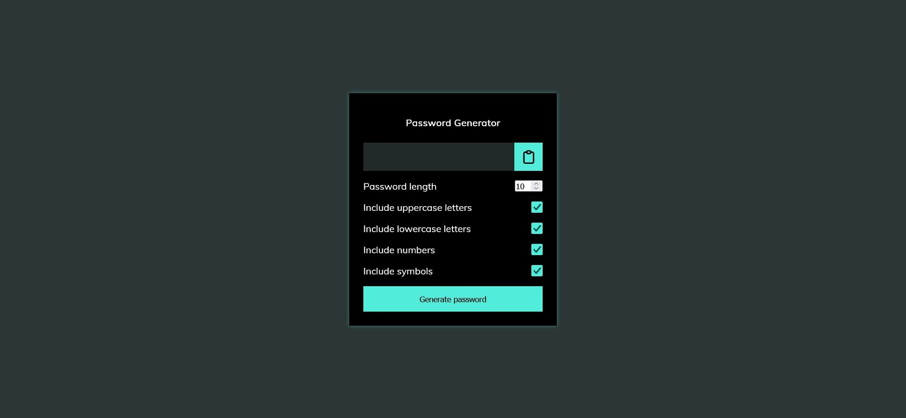

# icodethis - Password Generator

This is a solution to a challenge "Make Me Functional" from the website <https://icodethis.com/modes/functional/12>.

## Table of contents

- [icodethis - Password Generator](#icodethis---password-generator)
  - [Table of contents](#table-of-contents)
  - [Task](#task)
  - [Screenshot](#screenshot)
  - [Links](#links)
  - [Built with](#built-with)
  - [Author](#author)

## Task

Make Me Functional
In this mode, you are given the HTML and CSS template and your focus should be on adding the required functionality with JS.
Implement the following functionalities:
clicking on the “Generate password” button should generate a random password based on the checks the user selects above, and the length specified
the password should be displayed inside the #result &lt;span&gt;
clicking on the Clipboard button should copy the password to your clipboard, and show the message “Password copied to your clipboard!”

## Screenshot

## Links

[Password Generator](https://your-solution-url.com)

## Built with

- Vanilla JS

## Author

- Website - [Andrei Martinenko](https://www.frontender.biz)
- Github - [@AxinitM](https://github.com/AxinitM)
- ICodeThis - [Axinit](https://icodethis.com/Axinit)
